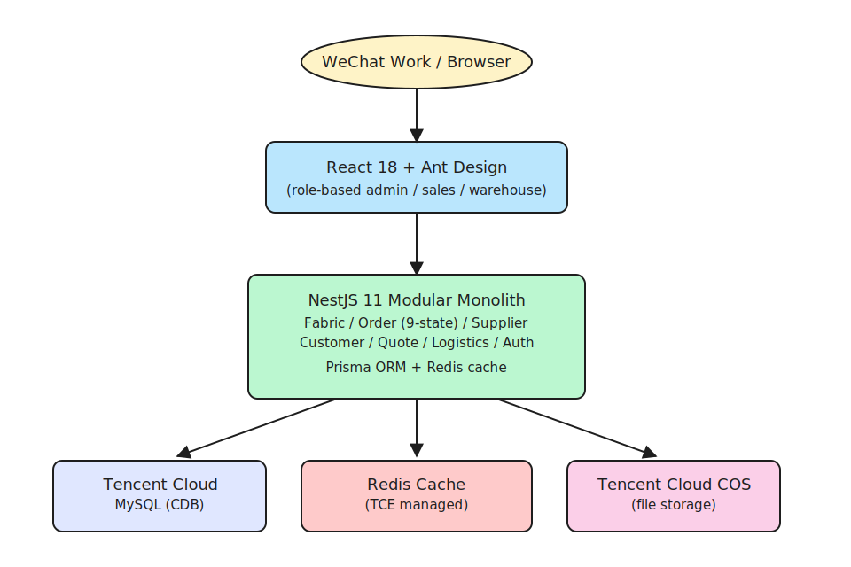

<div align="center">

# Borealis Fabrics

[](https://www.typescriptlang.org/)
[](https://nestjs.com/)
[](https://react.dev/)
[](https://prisma.io/)
[](https://mysql.com/)
[](https://redis.io/)
[](LICENSE)

**Production supply chain platform for a B2B fabric intermediary managing 500+ monthly orders.**

[English](#english) | [中文](#中文)

</div>

---

## Demo


Placeholder color-band frame; live UI recording pending (project is behind WeChat Work OAuth — full interactive demo requires controlled recording session).

---

## English

### Problem

A B2B fabric intermediary managing 500+ monthly orders for 100+ suppliers and 50+ customers needed to digitize their entire inquiry-to-settlement workflow. Manual tracking was unsustainable at scale -- order status was scattered across WeChat messages, spreadsheets, and paper records.

### Overview

Borealis Fabrics is a production supply chain platform that digitizes the full fabric trading lifecycle. Built during a software engineering internship at U2 Living (Nov 2025 -- Feb 2026), it handles everything from fabric catalog management to order tracking, supplier coordination, and payment reconciliation with real-time status updates.

### Key Features

- **Fabric Management** -- Centralized fabric catalog with multi-condition search, supplier associations, and customer-specific pricing
- **Order Management** -- Full order lifecycle with 9-state machine, multi-item tracking, and dual-side payment management
- **Supplier Management** -- Comprehensive supplier profiles with status tracking and settlement configurations
- **Customer Management** -- B2B customer profiles with credit terms and special pricing
- **Quote Management** -- Quote creation with validity management and one-click order conversion
- **Logistics Tracking** -- Per-item logistics recording with split shipment support
- **Batch Import** -- Excel bulk import for fabrics and suppliers
- **WeChat OAuth** -- Enterprise WeChat integration for seamless authentication

### Tech Stack

| Layer | Technology |
|-------|-----------|
| Backend | Node.js + NestJS 11 + TypeScript (strict mode) |
| Frontend | React 18 + TypeScript + Ant Design |
| Database | MySQL (Tencent Cloud CDB) |
| ORM | Prisma |
| Cache | Redis |
| File Storage | Tencent Cloud COS |
| Auth | WeChat Work OAuth 2.0 |
| CI/CD | GitHub Actions + Tencent Cloud deployment |

### Architecture



Source: [architecture.excalidraw](assets/architecture.excalidraw) — drag to [excalidraw.com](https://excalidraw.com) to edit.

### AI-Augmented Development

This production platform was developed using Claude Code for rapid iteration across the full stack:

- **400+ commits** of production code developed with AI-assisted coding
- Claude Code accelerated the implementation of complex business logic (9-state order engine, dual-side payment reconciliation)
- AI-assisted test writing and debugging for enterprise-grade reliability

### Project Metrics

| Metric | Value |
|--------|-------|
| Monthly Orders | 500+ |
| Suppliers | 100+ |
| Customers | 50+ |
| Total Commits | 400+ |
| Order States | 9 |
| Development Period | Nov 2025 -- Feb 2026 |

### Quick Start

```bash
# Clone the repository
git clone git@github.com:r1ckyIn/borealis-fabrics.git
cd borealis-fabrics

# Start local development environment
docker compose -f backend/docker-compose.yml up -d

# Backend setup
cd backend
pnpm install
npx prisma migrate dev
pnpm start:dev

# Frontend setup (new terminal)
cd frontend
pnpm install
pnpm dev
```

### Project Structure

```
borealis-fabrics/
├── docs/                  # Requirements and documentation
├── backend/               # NestJS backend (Modular Monolith)
│   ├── src/               # Source code
│   ├── prisma/            # Database schema and migrations
│   └── test/              # Tests (unit + integration)
├── frontend/              # React Web frontend (desktop-first)
│   └── src/               # Source code
└── .github/workflows/     # CI/CD pipeline
```

### Why Story

borealis-fabrics was the U2 Living supply-chain platform: 500+ monthly orders, 400+ commits, production since 2024. The challenge was coordinating WeChat Work as the front-line communication channel (the only tool field operators would use) with a structured NestJS backend that the finance team needed. Modular monolith beat microservices for a 3-person team — we shipped more and debugged less. Prisma + MySQL on Tencent Cloud kept the ops surface tight; a 9-state order machine and dual-side payment tracking (supplier + customer) took the accounting complexity out of spreadsheets and into invariants the code enforces. The story is about pragmatic full-stack for B2B workflows, not a portfolio showpiece.

---

## 中文

### 问题背景

一家管理 500+ 月订单、服务 100+ 供应商和 50+ 客户的 B2B 面料中间商，需要将整个询价到结算的工作流程数字化。手动跟踪在这个规模下不可持续 -- 订单状态分散在微信消息、电子表格和纸质记录中。

### 项目概述

铂润面料（Borealis Fabrics）是一个生产供应链平台，覆盖面料贸易的完整生命周期。在 U2 Living 的软件工程实习期间（2025年11月 -- 2026年2月）开发，处理从面料目录管理到订单跟踪、供应商协调和付款对账的全部流程，支持实时状态更新。

### 功能特性

- **面料管理** -- 统一面料目录，支持多条件检索、供应商关联和客户专属定价
- **订单管理** -- 完整的订单生命周期管理，9 状态流转、多面料独立跟踪、双向付款管理
- **供应商管理** -- 完整的供应商信息管理，含合作状态跟踪和结算方式配置
- **客户管理** -- B 端客户信息管理，支持账期和特殊定价
- **报价管理** -- 报价创建与有效期管理，支持一键转订单
- **物流跟踪** -- 按面料记录物流信息，支持分批发货
- **批量导入** -- 支持 Excel 批量导入面料和供应商数据
- **企业微信认证** -- 企业微信 OAuth 集成，无缝身份验证

### AI 辅助开发

此生产平台使用 Claude Code 进行全栈快速迭代开发：

- **400+ 次提交**，利用 AI 辅助编程完成生产级代码
- Claude Code 加速了复杂业务逻辑的实现（9 状态订单引擎、双向付款对账）

### 快速开始

```bash
# 克隆仓库
git clone git@github.com:r1ckyIn/borealis-fabrics.git
cd borealis-fabrics

# 启动本地开发环境
docker compose -f backend/docker-compose.yml up -d

# 后端启动
cd backend
pnpm install
npx prisma migrate dev
pnpm start:dev

# 前端启动（新终端）
cd frontend
pnpm install
pnpm dev
```

---

## License

MIT License

## Author

**Ricky Yuan** - CS + Mathematics @ University of Sydney

[](https://github.com/r1ckyIn)
[](https://linkedin.com/in/rickyyyyy)
