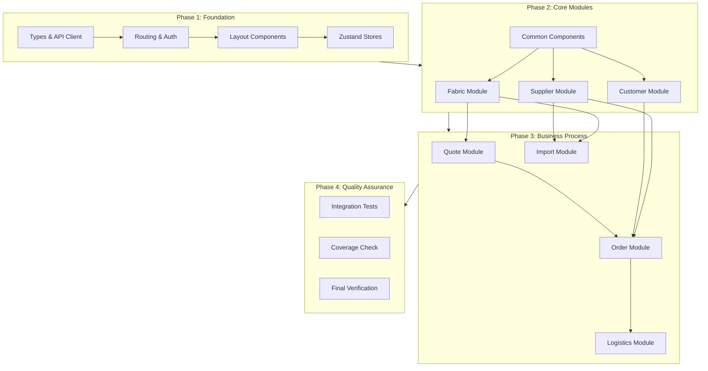
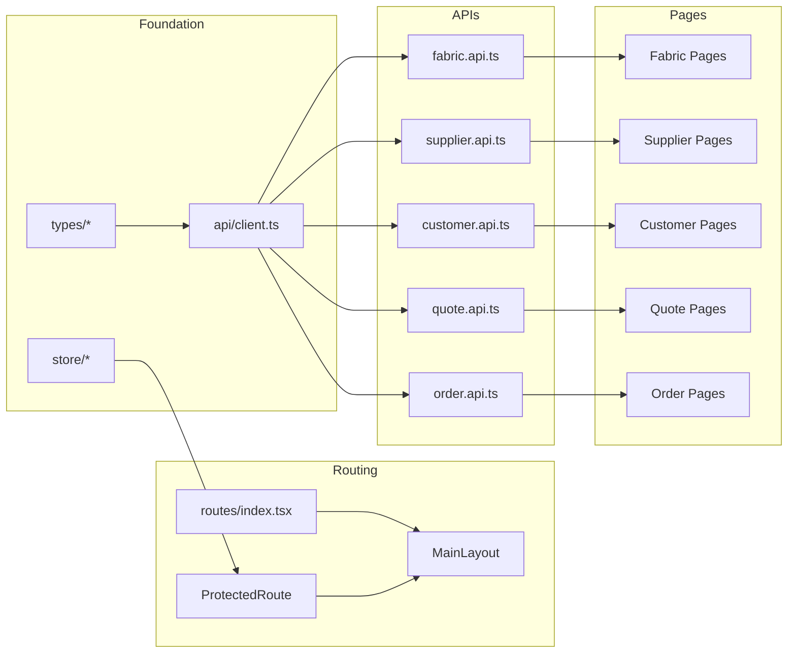

# Work Plan: Frontend Phase 4 Implementation

Created Date: 2026-02-05
Type: feature
Estimated Duration: 15-20 days
Estimated Impact: ~80+ files
Related Issue/PR: N/A (new implementation)

## Related Documents
- Design Doc: [docs/design/frontend-design-doc.md](../design/frontend-design-doc.md)
- ADR: [docs/adr/001-modular-monolith.md](../adr/001-modular-monolith.md)
- Architecture: [docs/ARCHITECTURE.md](../ARCHITECTURE.md)

## Objective

Implement the complete frontend for Borealis Fabrics digital management system, providing a web-based administrative dashboard for fabric trade intermediaries. This covers the entire business flow from inquiry and quotation to order fulfillment and payment tracking.

## Background

The backend (39 API endpoints across 7 modules) is fully completed in Phase 3. The frontend currently only has placeholder files (App.tsx, main.tsx). This phase implements:
- 21 pages across 7 modules
- Authentication with WeWork OAuth
- Complex order state machine UI (9 states)
- Bidirectional payment tracking

## Phase Structure Diagram



## Task Dependency Diagram



## Risks and Countermeasures

### Technical Risks

- **Risk**: WeWork OAuth complexity in development environment
  - **Impact**: High - may block authentication testing
  - **Countermeasure**: Test OAuth flow early in Phase 1; implement mock auth for development

- **Risk**: Order state machine bugs with 9 states
  - **Impact**: High - core business functionality
  - **Countermeasure**: Comprehensive unit tests for statusHelpers; visual state flow diagram in UI

- **Risk**: Form performance with many order items
  - **Impact**: Medium - UX degradation
  - **Countermeasure**: Virtualized lists; form field optimization; lazy loading

- **Risk**: Bundle size growth
  - **Impact**: Medium - page load performance
  - **Countermeasure**: Code splitting by route; tree shaking; monitor bundle size

### Schedule Risks

- **Risk**: Complex OrderModule may take longer than estimated
  - **Impact**: Medium - schedule delay
  - **Countermeasure**: Start OrderModule early in Phase 3; parallel development of simpler modules

---

## Implementation Phases

### Phase 1: Foundation (Estimated commits: 8-12)

**Purpose**: Establish core infrastructure including types, API client, routing, authentication, and layout components.

#### Task 1.1: Type Definitions
**Files to create**:
- `frontend/src/types/api.types.ts` - API response types (PaginatedResponse, ApiResponse, ApiError)
- `frontend/src/types/entities.types.ts` - Entity types (Fabric, Supplier, Customer, Order, Quote, etc.)
- `frontend/src/types/enums.types.ts` - Enum types (OrderItemStatus, QuoteStatus, PayStatus, etc.)
- `frontend/src/types/forms.types.ts` - Form data types
- `frontend/src/types/index.ts` - Type exports

**Completion Criteria**:
- [ ] All entity types match backend DTOs
- [ ] All enums match backend definitions
- [ ] Type exports organized
- [ ] TypeScript strict mode passes

---

#### Task 1.2: Utility Functions
**Files to create**:
- `frontend/src/utils/format.ts` - Date, currency, number formatting
- `frontend/src/utils/validation.ts` - Form validation helpers
- `frontend/src/utils/constants.ts` - Application constants
- `frontend/src/utils/statusHelpers.ts` - Order status utilities (valid transitions, aggregate calculation)
- `frontend/src/utils/index.ts` - Utility exports

**Completion Criteria**:
- [ ] formatDate, formatCurrency, formatNumber implemented
- [ ] Status transition validation working
- [ ] Aggregate status calculation correct
- [ ] Unit tests for all utilities (>80% coverage)

---

#### Task 1.3: API Client Setup
**Files to create**:
- `frontend/src/api/client.ts` - Axios instance with interceptors
- `frontend/src/api/auth.api.ts` - Authentication endpoints
- `frontend/src/api/system.api.ts` - System endpoints (enums, health)

**Completion Criteria**:
- [ ] Axios instance configured with base URL
- [ ] Request interceptor adds JWT token
- [ ] Response interceptor handles 401 (redirect to login)
- [ ] Error interceptor logs and transforms errors
- [ ] Auth API methods working

---

#### Task 1.4: Zustand Stores
**Files to create**:
- `frontend/src/store/authStore.ts` - Authentication state (user, token, login/logout)
- `frontend/src/store/uiStore.ts` - UI state (sidebar collapsed, loading states)
- `frontend/src/store/enumStore.ts` - Cached enum values with Chinese labels
- `frontend/src/store/index.ts` - Store exports

**Completion Criteria**:
- [ ] AuthStore manages JWT and user info
- [ ] Token persisted to localStorage
- [ ] EnumStore fetches and caches on app init
- [ ] UIStore controls sidebar state

---

#### Task 1.5: Routing Setup
**Files to create**:
- `frontend/src/routes/index.tsx` - Route definitions with React Router 7
- `frontend/src/routes/ProtectedRoute.tsx` - Auth guard component

**Completion Criteria**:
- [ ] All routes defined (21 pages)
- [ ] ProtectedRoute redirects to login when not authenticated
- [ ] Route-based code splitting configured
- [ ] 404 handling implemented

---

#### Task 1.6: Layout Components ✅
**Files to create**:
- `frontend/src/routes/layouts/MainLayout.tsx` - Main app layout
- `frontend/src/components/layout/Sidebar.tsx` - Navigation sidebar
- `frontend/src/components/layout/Header.tsx` - Top header bar
- `frontend/src/components/layout/PageContainer.tsx` - Page wrapper with breadcrumbs
- `frontend/src/components/layout/index.ts` - Component exports

**Completion Criteria**:
- [x] MainLayout renders Sidebar + Header + Content
- [x] Sidebar shows navigation menu with icons
- [x] Sidebar collapsible functionality works
- [x] Header shows user info and logout button
- [x] PageContainer shows title and breadcrumbs
- [x] Responsive layout on tablet screens

---

#### Task 1.7: Authentication Pages
**Files to create**:
- `frontend/src/pages/auth/LoginPage.tsx` - Login page with WeWork button
- `frontend/src/pages/auth/OAuthCallback.tsx` - OAuth callback handler

**Completion Criteria**:
- [ ] Login page renders WeWork OAuth button
- [ ] Button redirects to WeWork auth URL
- [ ] Callback page handles success/error
- [ ] Successful auth redirects to dashboard
- [ ] Failed auth shows error and retry option

---

#### Phase 1 Completion Criteria
- [ ] All foundation files created
- [ ] `pnpm build` succeeds
- [ ] `pnpm lint` passes
- [ ] `pnpm typecheck` passes
- [ ] Unit tests for utilities pass (>80% coverage)
- [ ] Login flow works (redirect to WeWork)
- [ ] Protected routes redirect when not authenticated

#### Phase 1 Operational Verification
1. Run `pnpm dev` - app loads without errors
2. Navigate to `/fabrics` - redirects to `/login`
3. Click WeWork login - redirects to OAuth URL
4. Verify sidebar renders with all menu items
5. Verify header shows user placeholder

---

### Phase 2: Core Modules (Estimated commits: 15-20)

**Purpose**: Implement Fabric, Supplier, and Customer modules with full CRUD functionality and common components.

#### Task 2.1: Common Components
**Files to create**:
- `frontend/src/components/common/SearchForm.tsx` - Reusable search/filter form
- `frontend/src/components/common/StatusTag.tsx` - Colored status badge
- `frontend/src/components/common/AmountDisplay.tsx` - Currency display
- `frontend/src/components/common/LoadingSpinner.tsx` - Loading indicator
- `frontend/src/components/common/ErrorBoundary.tsx` - Error boundary
- `frontend/src/components/common/ConfirmModal.tsx` - Confirmation dialog
- `frontend/src/components/common/index.ts` - Component exports

**Completion Criteria**:
- [ ] SearchForm supports text, select, date range fields
- [ ] StatusTag displays correct colors per status type
- [ ] AmountDisplay formats currency with symbol
- [ ] All components have proper TypeScript types
- [ ] Unit tests for StatusTag color logic

---

#### Task 2.2: Business Components (Part 1)
**Files to create**:
- `frontend/src/components/business/ImageUploader.tsx` - Image upload with preview
- `frontend/src/components/business/AddressManager.tsx` - Address CRUD
- `frontend/src/components/business/FabricSelector.tsx` - Fabric selection dropdown
- `frontend/src/components/business/SupplierSelector.tsx` - Supplier selection
- `frontend/src/components/business/CustomerSelector.tsx` - Customer selection

**Completion Criteria**:
- [ ] ImageUploader supports multiple images with drag-drop
- [ ] AddressManager handles add/edit/delete/default
- [ ] Selectors support search and pagination
- [ ] Components integrate with TanStack Query

---

#### Task 2.3: API Services (Core)
**Files to create**:
- `frontend/src/api/fabric.api.ts` - Fabric CRUD + images + suppliers + pricing
- `frontend/src/api/supplier.api.ts` - Supplier CRUD + fabrics
- `frontend/src/api/customer.api.ts` - Customer CRUD + pricing + orders
- `frontend/src/api/file.api.ts` - File upload

**Completion Criteria**:
- [ ] All API methods match backend endpoints
- [ ] Proper TypeScript return types
- [ ] Error handling consistent

---

#### Task 2.4: TanStack Query Hooks (Core)
**Files to create**:
- `frontend/src/hooks/queries/useFabrics.ts` - Fabric queries and mutations
- `frontend/src/hooks/queries/useSuppliers.ts` - Supplier queries and mutations
- `frontend/src/hooks/queries/useCustomers.ts` - Customer queries and mutations
- `frontend/src/hooks/queries/useEnums.ts` - Enum query hook
- `frontend/src/hooks/usePagination.ts` - Pagination logic
- `frontend/src/hooks/useDebounce.ts` - Debounce hook
- `frontend/src/hooks/useLocalStorage.ts` - localStorage hook

**Completion Criteria**:
- [ ] Query hooks return proper loading/error states
- [ ] Mutations invalidate relevant queries
- [ ] Pagination hook integrates with URL params
- [ ] Debounce works for search inputs

---

#### Task 2.5: Fabric Module Pages
**Files to create**:
- `frontend/src/pages/fabrics/FabricListPage.tsx` - List with search/filter/pagination
- `frontend/src/pages/fabrics/FabricDetailPage.tsx` - Detail view with tabs
- `frontend/src/pages/fabrics/FabricFormPage.tsx` - Create/Edit form
- `frontend/src/components/forms/FabricForm.tsx` - Fabric form component

**Completion Criteria**:
- [ ] List shows pagination, search, filter by status
- [ ] Detail shows fabric info, images, suppliers, pricing
- [ ] Form validates all required fields
- [ ] Image upload works with preview
- [ ] Supplier association with price/lead time
- [ ] Customer special pricing management

---

#### Task 2.6: Supplier Module Pages
**Files to create**:
- `frontend/src/pages/suppliers/SupplierListPage.tsx`
- `frontend/src/pages/suppliers/SupplierDetailPage.tsx`
- `frontend/src/pages/suppliers/SupplierFormPage.tsx`
- `frontend/src/components/forms/SupplierForm.tsx`

**Completion Criteria**:
- [ ] List shows pagination, search by company name
- [ ] Detail shows supplier info and fabric list
- [ ] Form validates settle type and credit days logic
- [ ] Delete blocked with 409 message if has active orders

---

#### Task 2.7: Customer Module Pages
**Files to create**:
- `frontend/src/pages/customers/CustomerListPage.tsx`
- `frontend/src/pages/customers/CustomerDetailPage.tsx`
- `frontend/src/pages/customers/CustomerFormPage.tsx`
- `frontend/src/components/forms/CustomerForm.tsx`

**Completion Criteria**:
- [ ] List shows pagination, search by company name
- [ ] Detail shows customer info, addresses, pricing, order history
- [ ] Address manager works (add/edit/delete/set default)
- [ ] Special pricing management works
- [ ] Order history displays correctly

---

#### Phase 2 Completion Criteria
- [ ] All 3 modules fully functional (Fabric, Supplier, Customer)
- [ ] All common components implemented
- [ ] `pnpm build` succeeds
- [ ] `pnpm test` passes
- [ ] `pnpm lint` passes
- [ ] List pages load data correctly
- [ ] CRUD operations work end-to-end

#### Phase 2 Operational Verification
1. Create a new supplier - verify appears in list
2. Create a new customer with addresses - verify address manager
3. Create a new fabric with images - verify image upload
4. Associate supplier to fabric with price - verify association
5. Set customer special pricing - verify pricing table
6. Edit each entity - verify form pre-population
7. Delete entity (soft delete) - verify removal from list

---

### Phase 3: Business Process Modules (Estimated commits: 20-25)

**Purpose**: Implement Quote, Order, Logistics, and Import modules with complex business logic.

#### Task 3.1: Quote API and Hooks
**Files to create**:
- `frontend/src/api/quote.api.ts` - Quote CRUD + convert to order
- `frontend/src/hooks/queries/useQuotes.ts` - Quote queries and mutations

**Completion Criteria**:
- [ ] All quote API methods implemented
- [ ] Convert to order mutation works
- [ ] Query invalidation on mutations

---

#### Task 3.2: Quote Module Pages
**Files to create**:
- `frontend/src/pages/quotes/QuoteListPage.tsx`
- `frontend/src/pages/quotes/QuoteDetailPage.tsx`
- `frontend/src/pages/quotes/QuoteFormPage.tsx`
- `frontend/src/components/forms/QuoteForm.tsx`

**Completion Criteria**:
- [ ] List shows status badges (active/expired/converted)
- [ ] Expired quotes auto-marked (frontend reflects backend)
- [ ] Detail shows convert button for active quotes
- [ ] Convert creates order and navigates to order detail
- [ ] Edit/delete disabled for converted quotes

---

#### Task 3.3: Business Components (Part 2)
**Files to create**:
- `frontend/src/components/business/OrderTimeline.tsx` - Status change timeline
- `frontend/src/components/business/OrderStatusFlow.tsx` - 9-state visual flow
- `frontend/src/components/business/PaymentStatusCard.tsx` - Payment summary
- `frontend/src/components/business/PricingTable.tsx` - Pricing display

**Completion Criteria**:
- [ ] OrderTimeline shows chronological status changes
- [ ] OrderStatusFlow visualizes 9 states with current highlighted
- [ ] PaymentStatusCard shows payable/paid/status with progress
- [ ] Components support both customer and supplier payment views

---

#### Task 3.4: Order API and Hooks
**Files to create**:
- `frontend/src/api/order.api.ts` - Order CRUD + items + status + payments
- `frontend/src/hooks/queries/useOrders.ts` - Order queries and mutations

**Completion Criteria**:
- [ ] All 17 order API methods implemented
- [ ] Status change mutation validates transitions
- [ ] Cancel/restore mutations work
- [ ] Payment update mutations work

---

#### Task 3.5: Order Module Pages
**Files to create**:
- `frontend/src/pages/orders/OrderListPage.tsx`
- `frontend/src/pages/orders/OrderDetailPage.tsx`
- `frontend/src/pages/orders/OrderFormPage.tsx`
- `frontend/src/components/forms/OrderForm.tsx`
- `frontend/src/components/forms/OrderItemForm.tsx`

**Completion Criteria**:
- [x] List shows aggregate status and payment status
- [x] Detail shows items with individual statuses
- [x] Detail shows customer payment card
- [x] Detail shows supplier payment cards (per supplier)
- [x] Status change buttons follow state machine rules
- [x] Cancel/restore functionality works
- [x] Timeline shows all status changes
- [x] Add/edit/delete items works
- [x] Amount calculations correct (subtotal, total, payables)

---

#### Task 3.6: Logistics API and Integration
**Files to create**:
- `frontend/src/api/logistics.api.ts` - Logistics CRUD
- `frontend/src/hooks/queries/useLogistics.ts` - Logistics hooks
- `frontend/src/components/forms/LogisticsForm.tsx` - Logistics form

**Completion Criteria**:
- [x] Logistics form integrated in order detail
- [x] Create logistics linked to order item
- [x] Logistics info displays in order timeline
- [x] Edit/delete logistics works

---

#### Task 3.7: Import Module
**Files to create**:
- `frontend/src/api/import.api.ts` - Import endpoints
- `frontend/src/pages/import/ImportPage.tsx`
- `frontend/src/components/business/ImportResultModal.tsx`

**Completion Criteria**:
- [x] Download template buttons work (fabric, supplier)
- [x] File upload with drag-drop
- [x] Progress indicator during import
- [x] Result modal shows success/skipped/failed counts
- [x] Failed rows listed with reasons

---

#### Phase 3 Completion Criteria
- [x] Quote module fully functional with conversion
- [x] Order module handles all 9 states
- [x] Payment tracking works (customer and supplier)
- [x] Logistics records manageable
- [x] Import with result reporting
- [x] All acceptance criteria from Design Doc met

#### Phase 3 Operational Verification
1. Create quote -> Convert to order -> Verify order created with PENDING status
2. Add order items -> Verify amount calculations
3. Change item status through all 9 states -> Verify state machine
4. Cancel item -> Verify prevStatus saved -> Restore -> Verify status restored
5. Update customer payment -> Verify payment status card
6. Update supplier payment -> Verify per-supplier tracking
7. Add logistics to order item -> Verify in timeline
8. Import fabrics from Excel -> Verify result modal

---

### Phase 4: Quality Assurance (Required) (Estimated commits: 3-5)

**Purpose**: Overall quality assurance, performance optimization, and Design Doc consistency verification.

#### Task 4.1: Integration Tests
**Files to create/update**:
- `frontend/src/test/*.test.tsx` - Integration tests for critical flows

**Test Coverage**:
- [ ] Auth flow (login redirect, OAuth callback, logout)
- [ ] Fabric CRUD with API
- [ ] Order status change with state machine validation
- [ ] Payment update flows
- [ ] Quote to Order conversion

---

#### Task 4.2: Performance Optimization
**Tasks**:
- [ ] Verify code splitting by route
- [ ] Check bundle size (target: <500KB initial)
- [ ] Verify lazy loading for heavy components
- [ ] Test with 500+ orders, 100+ suppliers, 50+ customers

**Performance Targets**:
- [ ] Initial page load < 5 seconds
- [ ] Navigation < 2 seconds
- [ ] List pagination < 1 second
- [ ] Form submission < 3 seconds

---

#### Task 4.3: Design Doc Acceptance Criteria Verification
Verify all acceptance criteria from Design Doc:

**AC-AUTH**:
- [ ] Protected route redirects to login
- [ ] WeWork login button redirects correctly
- [ ] OAuth callback handles success/failure
- [ ] JWT session maintained with sliding expiration

**AC-FABRIC**:
- [ ] List with pagination, search, filter
- [ ] Row click navigates to detail
- [ ] Form creates/updates correctly
- [ ] Image upload with preview
- [ ] Supplier association saves price/lead time
- [ ] Customer pricing works

**AC-SUPPLIER**:
- [ ] List with pagination and search
- [ ] Detail shows fabric list
- [ ] Form validates correctly
- [ ] Delete blocked if has active orders

**AC-CUSTOMER**:
- [ ] List with pagination and search
- [ ] Detail shows addresses, pricing, orders
- [ ] Address manager works
- [ ] Order history displays

**AC-QUOTE**:
- [ ] List shows status badges
- [ ] Quote code generated (QT-YYMM-NNNN)
- [ ] Expired status displays correctly
- [ ] Convert to Order creates order
- [ ] Edit/delete disabled when converted

**AC-ORDER**:
- [ ] List shows aggregate status and payment
- [ ] At least one item required
- [ ] Subtotal calculated correctly
- [ ] State machine transitions validated
- [ ] Aggregate status recalculated
- [ ] Cancel saves prevStatus
- [ ] Restore uses prevStatus
- [ ] Timeline displays status history
- [ ] Customer payment updates work
- [ ] Supplier payment tracking works

**AC-LOGISTICS**:
- [ ] Create logistics linked to order item
- [ ] Displays in order detail
- [ ] Tracking number saved and displayed

**AC-IMPORT**:
- [ ] Template download works
- [ ] Excel upload parses correctly
- [ ] Existing records skipped
- [ ] Result summary displayed

---

#### Task 4.4: Final Quality Checks
- [ ] `pnpm build` succeeds
- [ ] `pnpm test` all tests pass
- [ ] `pnpm lint` no errors
- [ ] `pnpm typecheck` no errors
- [ ] Test coverage >80% for critical paths
- [ ] No console errors in browser
- [ ] Responsive layout works on tablet

---

#### Phase 4 Completion Criteria
- [ ] All acceptance criteria verified
- [ ] All tests pass
- [ ] Performance targets met
- [ ] No critical bugs
- [ ] Documentation updated (ARCHITECTURE.md)

#### Phase 4 Operational Verification
1. Complete order flow: Login -> Create Quote -> Convert to Order -> Update Status -> Complete
2. Batch import: Download Template -> Upload File -> Verify Results
3. Payment tracking: Create Order -> Update Customer Payment -> Update Supplier Payment
4. Performance test with realistic data volumes

---

## Files Summary

### New Files to Create (~80 files)

#### Types (5 files)
```
frontend/src/types/
├── api.types.ts
├── entities.types.ts
├── enums.types.ts
├── forms.types.ts
└── index.ts
```

#### Utils (5 files)
```
frontend/src/utils/
├── format.ts
├── validation.ts
├── constants.ts
├── statusHelpers.ts
└── index.ts
```

#### API (10 files)
```
frontend/src/api/
├── client.ts
├── auth.api.ts
├── system.api.ts
├── fabric.api.ts
├── supplier.api.ts
├── customer.api.ts
├── order.api.ts
├── quote.api.ts
├── logistics.api.ts
└── import.api.ts
```

#### Store (4 files)
```
frontend/src/store/
├── authStore.ts
├── uiStore.ts
├── enumStore.ts
└── index.ts
```

#### Routes (3 files)
```
frontend/src/routes/
├── index.tsx
├── ProtectedRoute.tsx
└── layouts/MainLayout.tsx
```

#### Hooks (10 files)
```
frontend/src/hooks/
├── useAuth.ts
├── usePagination.ts
├── useDebounce.ts
├── useLocalStorage.ts
└── queries/
    ├── useFabrics.ts
    ├── useSuppliers.ts
    ├── useCustomers.ts
    ├── useOrders.ts
    ├── useQuotes.ts
    ├── useLogistics.ts
    └── useEnums.ts
```

#### Components - Layout (4 files)
```
frontend/src/components/layout/
├── Sidebar.tsx
├── Header.tsx
├── PageContainer.tsx
└── index.ts
```

#### Components - Common (7 files)
```
frontend/src/components/common/
├── SearchForm.tsx
├── StatusTag.tsx
├── AmountDisplay.tsx
├── LoadingSpinner.tsx
├── ErrorBoundary.tsx
├── ConfirmModal.tsx
└── index.ts
```

#### Components - Business (11 files)
```
frontend/src/components/business/
├── OrderTimeline.tsx
├── OrderStatusFlow.tsx
├── AddressManager.tsx
├── PricingTable.tsx
├── ImageUploader.tsx
├── FabricSelector.tsx
├── SupplierSelector.tsx
├── CustomerSelector.tsx
├── PaymentStatusCard.tsx
├── ImportResultModal.tsx
└── index.ts
```

#### Components - Forms (8 files)
```
frontend/src/components/forms/
├── FabricForm.tsx
├── SupplierForm.tsx
├── CustomerForm.tsx
├── OrderForm.tsx
├── OrderItemForm.tsx
├── QuoteForm.tsx
├── LogisticsForm.tsx
└── index.ts
```

#### Pages - Auth (2 files)
```
frontend/src/pages/auth/
├── LoginPage.tsx
└── OAuthCallback.tsx
```

#### Pages - Fabrics (3 files)
```
frontend/src/pages/fabrics/
├── FabricListPage.tsx
├── FabricDetailPage.tsx
└── FabricFormPage.tsx
```

#### Pages - Suppliers (3 files)
```
frontend/src/pages/suppliers/
├── SupplierListPage.tsx
├── SupplierDetailPage.tsx
└── SupplierFormPage.tsx
```

#### Pages - Customers (3 files)
```
frontend/src/pages/customers/
├── CustomerListPage.tsx
├── CustomerDetailPage.tsx
└── CustomerFormPage.tsx
```

#### Pages - Orders (3 files)
```
frontend/src/pages/orders/
├── OrderListPage.tsx
├── OrderDetailPage.tsx
└── OrderFormPage.tsx
```

#### Pages - Quotes (3 files)
```
frontend/src/pages/quotes/
├── QuoteListPage.tsx
├── QuoteDetailPage.tsx
└── QuoteFormPage.tsx
```

#### Pages - Import (1 file)
```
frontend/src/pages/import/
└── ImportPage.tsx
```

### Existing Files to Modify (2 files)
```
frontend/src/App.tsx - Add providers (QueryClient, Router)
frontend/src/main.tsx - Keep as is (entry point)
```

---

## Completion Criteria

- [ ] All phases completed
- [ ] All 21 pages implemented
- [ ] All acceptance criteria from Design Doc satisfied
- [ ] `pnpm build` succeeds
- [ ] `pnpm test` passes with >80% coverage on critical paths
- [ ] `pnpm lint` passes
- [ ] `pnpm typecheck` passes
- [ ] Performance targets met (page load <5s, navigation <2s)
- [ ] No console errors in browser
- [ ] Chinese localization displays correctly
- [ ] Responsive layout works on tablet
- [ ] ARCHITECTURE.md updated with Phase 4 completion

---

## Progress Tracking

### Phase 1: Foundation
- Start: YYYY-MM-DD HH:MM
- Complete: YYYY-MM-DD HH:MM
- Notes:

### Phase 2: Core Modules
- Start: YYYY-MM-DD HH:MM
- Complete: YYYY-MM-DD HH:MM
- Notes:

### Phase 3: Business Process Modules
- Start: YYYY-MM-DD HH:MM
- Complete: YYYY-MM-DD HH:MM
- Notes:

### Phase 4: Quality Assurance
- Start: YYYY-MM-DD HH:MM
- Complete: YYYY-MM-DD HH:MM
- Notes:

---

## Notes

### Development Guidelines
1. Follow TDD where practical - write tests before implementation
2. One feature per commit, use `/commit` for consistent messages
3. Run `pnpm build && pnpm test && pnpm lint` after each task
4. Update progress tracking after completing each phase

### Chinese Localization
- All status labels from `/system/enums` endpoint
- Use Ant Design ConfigProvider with zh_CN locale
- Date format: YYYY-MM-DD
- Currency format: CNY with Yuan symbol

### API Integration
- Base URL via Vite proxy: `/api` -> `http://localhost:3000`
- JWT token in Authorization header: `Bearer {token}`
- All endpoints documented in ARCHITECTURE.md Section 9.4

### Testing Strategy
- Unit tests: Status helpers, format utilities
- Component tests: Forms, StatusTag, AmountDisplay
- Integration tests: Auth flow, CRUD operations, state machine
- E2E (if time permits): Complete order flow
